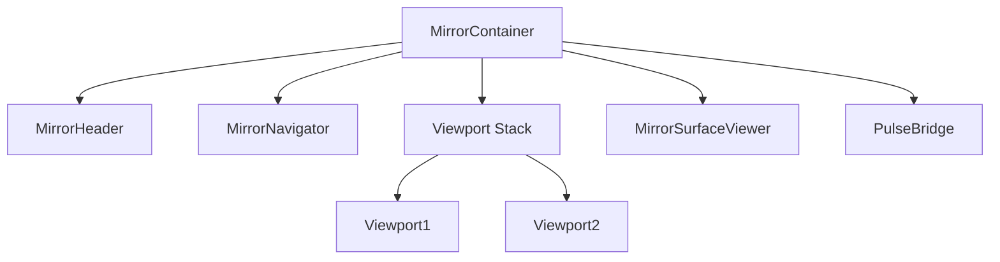

# **MIRROR BASE UI FRAMEWORK**

**Design Brief + Development Specification**
**Prepared by:** Brady Simmons
**Date:** October 31, 2025
**Version:** 1.0

---

## **1. Executive Summary**

This document defines the **Mirror Base UI Framework**, a modular, schema-driven interface system built on **Mirror v2**.
It converts the original Mirror prototype (monolithic layout) into a **composable, theme-aware, and app-extensible framework** that supports dynamic UI generation from JSON schemas.

The goal:

> “Create a semantic, modular foundation for all Mirror-based applications — where apps, components, and data flows can be dynamically defined, connected, and governed.”

---

## **2. Objectives**

| Goal                              | Description                                                                                                                                                       |
| --------------------------------- | ----------------------------------------------------------------------------------------------------------------------------------------------------------------- |
| **1. Modularize the previous UI** | Extract all core UI elements (header, navigator, viewports, surface viewer) from the previous version and rebuild as discrete, reusable schema-driven components. |
| **2. Schema-Driven Rendering**    | All layout and behavior should be defined in JSON schemas loaded dynamically from `/apps/[app-name]/`.                                                            |
| **3. App-Centric Framework**      | Mirror should function as a blank “canvas,” with each app (DexaBooks, SAGE, etc.) loading its own layout schemas.                                                 |
| **4. Dynamic Interconnection**    | Enable inter-module communication through a Pulse-like connection system (MirrorBus or PulseBridge).                                                              |
| **5. Theming and Extensibility**  | Theme switching and app-level layout customization (header, navigator, color palette) should be plug-and-play.                                                    |

---

## **3. System Overview**

Mirror Base acts as the **parent container** for all apps and components in the Mirror ecosystem.
It defines the top-level structure that loads dynamically:

```
Mirror Framework
├── Header
├── Navigator
├── Surface Viewer (optional)
├── Viewports (1–n)
└── Context Bus (MirrorBus + PulseBridge)
```

Each of these is a **modular component** loaded by the **Renderer** based on schema definitions.

---

## **4. Architecture Layers**

| Layer                   | Purpose                                                       | Implementation                         |
| ----------------------- | ------------------------------------------------------------- | -------------------------------------- |
| **Framework Layer**     | Core systems (Renderer, EventBus, AppRegistry, MirrorContext) | `mirror/client/src/core`               |
| **Application Layer**   | Defines layouts, themes, and schemas for each app             | `mirror/client/src/apps/[app-name]/`   |
| **Component Layer**     | Individual modular components (UI + logic)                    | `mirror/client/src/components/mirror/` |
| **Communication Layer** | Governs data and event flow (PulseBridge, MirrorBus)          | `mirror/client/src/core/pulse`         |
| **Schema Layer**        | JSON blueprints defining UI structure                         | `/apps/mirror-base/*.json`             |

---

## **5. Layout Hierarchy**

The Mirror Base UI follows a **five-element hierarchy**:

1. **Header** – Global controls, branding, and context actions.
2. **Navigator** – Left panel for context switching and module navigation.
3. **Viewports** – Main content regions. Multiple can be loaded simultaneously.
4. **Surface Viewer** – Floating workspace for preview, visualization, or reflection.
5. **PulseBridge / EventBus** – Communication channel between active components.

Example schematic:



---

## **6. Component Inventory (Extracted from Mirror v1)**

| Component                   | File                                                          | Purpose                                         | Status     |
| --------------------------- | ------------------------------------------------------------- | ----------------------------------------------- | ---------- |
| MirrorHeader                | `mirror/client/src/components/mirror/MirrorHeader.tsx`        | Top bar with title, upload button, theme toggle | ✅ Rebuilt  |
| MirrorNavigator             | `mirror/client/src/components/mirror/MirrorNavigator.tsx`     | Sidebar navigation and contextual links         | ✅ Rebuilt  |
| MirrorViewport              | `mirror/client/src/components/mirror/MirrorViewport.tsx`      | Main workspace container                        | ✅ Rebuilt  |
| MirrorSurfaceViewer         | `mirror/client/src/components/mirror/MirrorSurfaceViewer.tsx` | Overlay for visual/semantic feedback            | ✅ Rebuilt  |
| ResizablePanel              | `mirror/client/src/components/mirror/ResizablePanel.tsx`      | Split-pane resizable viewport support           | ✅ Rebuilt  |
| UploadButton                | `mirror/client/src/components/mirror/UploadButton.tsx`        | File upload (integrated with Core API)          | ✅ Rebuilt  |
| ThemeSwitcher               | `mirror/client/src/components/mirror/ThemeSwitcher.tsx`       | Theme control component                         | ✅ Rebuilt  |
| MirrorContainer             | `mirror/client/src/components/mirror/MirrorContainer.tsx`     | New base layout orchestrator                    | ✅ New      |
| MirrorContext / PulseBridge | `mirror/client/src/core/pulse/`                               | Data + event routing                            | 🧠 Planned |

---

## **7. Schema Design**

Each application within Mirror is defined by a set of **schemas** (JSON).
The schemas are stored in `/apps/[app-name]/` and define layout composition.

### Example: `/apps/mirror-base/app.json`

```json
{
  "id": "mirror-base",
  "label": "Mirror Base Framework",
  "headerSchema": "mirror-base/header",
  "navigatorSchema": "mirror-base/navigator",
  "surfaceViewerSchema": "mirror-base/surface-viewer",
  "viewports": ["mirror-base/viewport1", "mirror-base/viewport2"]
}
```

### Example: `/apps/mirror-base/header.json`

```json
{
  "type": "MirrorHeader",
  "props": {
    "title": "Mirror Base Framework",
    "actions": [
      { "type": "UploadButton", "props": { "label": "Upload" } },
      { "type": "ThemeSwitcher", "props": {} }
    ]
  }
}
```

---

## **8. Communication Layer (PulseBridge)**

To replace redundant API calls and create **live semantic channels**, implement:

### `/src/core/pulse/PulseBridge.ts`

```ts
export interface PulseConfig {
  id: string
  source: string
  target: string
  topics?: string[]
}

export class PulseBridge {
  private listeners = new Map<string, Set<(data: any) => void>>()

  constructor(public config: PulseConfig) {}

  send(topic: string, payload: any) {
    this.listeners.get(topic)?.forEach(cb => cb(payload))
  }

  on(topic: string, cb: (payload: any) => void) {
    if (!this.listeners.has(topic)) this.listeners.set(topic, new Set())
    this.listeners.get(topic)!.add(cb)
  }

  off(topic: string, cb: (payload: any) => void) {
    this.listeners.get(topic)?.delete(cb)
  }
}
```

### Integration:

* `MirrorContext` holds a global `PulseRegistry`.
* Components call `usePulse("logos↔mirror")`.
* Events become bidirectional semantic links, not API calls.

---

## **9. Development Workflow**

### 9.1 Component Registration

All new components must be registered in:
`/mirror/client/src/core/registerComponents.ts`

Example:

```ts
import { MirrorHeader, MirrorNavigator, MirrorViewport } from "@/components/mirror"
register("MirrorHeader", MirrorHeader)
register("MirrorNavigator", MirrorNavigator)
register("MirrorViewport", MirrorViewport)
```

### 9.2 App Creation Steps

1. Duplicate `/apps/mirror-base`
2. Rename folder and IDs (e.g., `dexabooks`, `sage`)
3. Modify schemas to define your new layout
4. Run `npm run dev` to test
5. Commit schema and component updates

---

## **10. Testing Plan**

| Stage             | Test                        | Expected Result                                     |
| ----------------- | --------------------------- | --------------------------------------------------- |
| **Unit**          | Load MirrorHeader           | Component renders with props                        |
| **Integration**   | Load `mirror-base/app.json` | Full layout loads (header, nav, viewports)          |
| **Communication** | Trigger Pulse event         | Event is received by paired component               |
| **Theming**       | Toggle theme                | All UI elements update                              |
| **Upload Flow**   | Upload document             | Ingests through Core API and displays coherence log |

---

## **11. Deployment Guide**

To test locally:

```bash
cd ~/sov
git pull origin main
cd mirror
npm install
npm run dev
# visit http://localhost:5173
```

For cloud deployment:

* Use `npm run build`
* Deploy `/dist` to Vercel or Manus
* Ensure `proxy-server.js` routes Core API to proper URL

---

## **12. Roadmap**

| Phase   | Focus                                          | Timeline       |
| ------- | ---------------------------------------------- | -------------- |
| Phase 1 | Extract and modularize legacy components       | Complete ✅     |
| Phase 2 | Implement `MirrorContainer` and schema binding | In progress 🧱 |
| Phase 3 | Build and test PulseBridge interconnection     | 1–2 days       |
| Phase 4 | Introduce SAGE + Core synchronization          | 1 week         |
| Phase 5 | Design and test dynamic theming system         | 1 week         |
| Phase 6 | Final integration + documentation              | Mid-November   |

---

## **13. Deliverables**

1. `mirror-base` app (fully modular)
2. 8 schema files defining layout
3. 7 modular UI components
4. `PulseBridge` (core connection layer)
5. Updated registry + documentation
6. Working live demo (via Manus or Vercel)

---

## **14. Next Steps**

**Immediate Action:**

* [ ] Verify all component imports resolve in `/registerComponents.ts`
* [ ] Confirm schema paths (`mirror-base/main`, `mirror-base/header`) match AppContainer expectations
* [ ] Implement `MirrorContainer` orchestration logic
* [ ] Deploy locally and confirm visual parity with old UI

**Then:**

* [ ] Implement PulseBridge module
* [ ] Replace internal API calls with semantic events
* [ ] Begin modular app development (DexaBooks, SAGE, Ingest)

---
