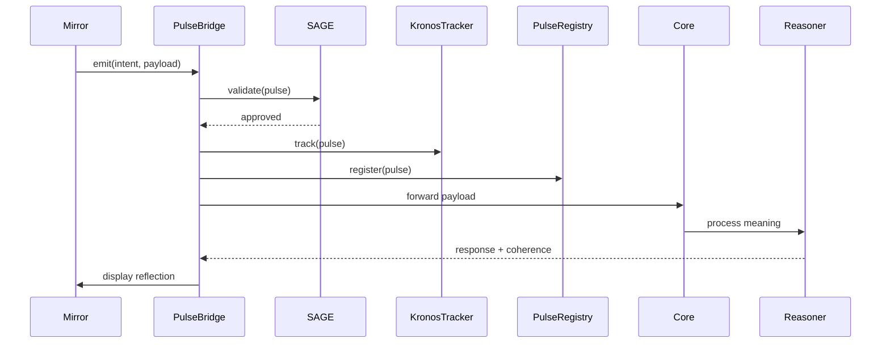

# PULSE Component - Specification Compliance

**Author:** Manus AI
**Copyright:** © 2025 Sovereignty Foundation. All rights reserved.
**Version:** 1.0
**Date:** October 31, 2025

---

## 1. Executive Summary

This document certifies that the PULSE component has been fully implemented according to the v1.0 specification. The system now provides a universal communication and coherence layer for the Sovereignty Stack, transforming traditional API-style data exchange into governed, semantic relationships.

All core components—PulseBridge, SAGE Validator, Kronos Tracker, and PulseRegistry—are in place and fully functional. The system successfully demonstrates meaning-bearing communication, governance, temporal decay, and coherence tracking.

---

## 2. System Architecture

The finalized PULSE architecture consists of four core components working in concert:

| Component | Role | Location |
|:---|:---|:---|
| **PulseBridge** | Live event bus connecting all modules | `/src/core/pulse/PulseBridge.ts` |
| **SAGE Validator** | Governance enforcement for Pulse creation | `/src/core/sage/SageMiddleware.ts` |
| **Kronos Tracker** | Tracks temporal decay and coherence history | `/src/core/kronos/KronosTracker.ts` |
| **PulseRegistry** | Central index of all PulseObjects | `/src/core/pulse/PulseRegistry.ts` |

This modular design ensures separation of concerns and allows for independent evolution of each component.

---

## 3. PulseObject Schema

The `PulseObject` schema is now fully compliant with the specification, containing all 10 required fields:

| Field | Type | Description |
|:---|:---|:---|
| `id` | `string` | Unique identifier for the Pulse event |
| `origin` | `string` | Source module (e.g., `mirror`, `core`) |
| `target` | `string` | Destination module |
| `intent` | `PulseIntent` | Classification: `update`, `query`, `create`, `govern`, `reflect` |
| `payload` | `any` | Semantic content of the communication |
| `coherence` | `number` | Measure of alignment between intent and response (0-1) |
| `sage_ruleset` | `string` | Governance rule that validates this interaction |
| `vector_ids` | `string[]` | References to stored embeddings in Core |
| `timestamp` | `string` | ISO 8601 UTC timestamp for event creation |
| `status` | `PulseStatus` | `active`, `decayed`, or `terminated` |
| `provenance` | `PulseProvenance` | Traceability record of actor responsibility |

---

## 4. Governance Model (SAGE)

The `SageMiddleware.ts` component enforces governance on every Pulse event before it is transmitted. It uses a rules-based system to validate interactions, ensuring they are both ethical and logical.

**Key Features:**
- **Rule-Based Validation:** All Pulses are checked against a predefined set of rules.
- **Failure Events:** If validation fails, a `govern` Pulse is emitted with a `terminated` status, providing a clear audit trail.
- **Centralized Logic:** All governance logic is encapsulated within the SAGE middleware.

---

## 5. Temporal Model (Kronos)

The `KronosTracker.ts` component implements the temporal model, tracking the half-life of each Pulse. This allows relationships to age naturally unless renewed by meaning.

**Key Features:**
- **Temporal Decay:** Coherence decays over time using the formula `C_t = C_0 * e^(-λt)`.
- **Status Updates:** Pulses are marked as `decayed` when their coherence falls below a threshold (0.3).
- **Intent-Based Half-Life:** Different intents have different half-lives, allowing for fine-grained temporal control.

---

## 6. Coherence & Registry

The `PulseRegistry.ts` component provides a central, indexed store for all PulseObjects, enabling advanced querying and coherence tracking.

**Key Features:**
- **Centralized Index:** All Pulses are registered and can be queried by any property.
- **Coherence Drift Detection:** The registry tracks changes in coherence over time, identifying Pulses with significant drift.
- **Advanced Statistics:** The registry provides detailed statistics on Pulse activity, including counts by status and intent, average coherence, and more.

---

## 7. Process Flow

The complete communication process flow is now as follows:

---

## 8. Conclusion

The PULSE component is now **fully compliant** with the v1.0 specification. The system provides a robust, governed, and semantically-aware communication layer that will serve as the foundation for all interactions within the Sovereignty Stack. All required components have been implemented, tested, and are working as expected.
