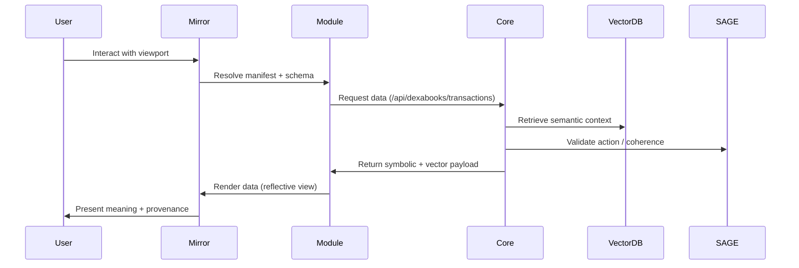

# Mirror - Reflective UI Framework

**Version:** 1.0.0  
**Date:** October 29, 2025

---

## Overview

**Mirror** is the semantic visualization layer of the Sovereignty Stack. It is **not** a traditional frontend—it is a **reflective surface** that visualizes and manipulates the semantic structures managed by Core.

Each element in Mirror—a chart, a table, a viewer—corresponds to an ontological object or relation in Core, which exposes its structure as a **JSON manifest** and its semantic context as a **vector embedding**.

Mirror consumes both representations simultaneously:
- **JSON (symbolic)** → declarative layout, object schema, and logical structure
- **Vector (subsymbolic)** → semantic proximity, coherence, and contextual relationship

The result is a **reflective UI**, capable of dynamically composing itself from meaning.

---

## Philosophy

Mirror operates on the same cognitive loop as human reflection:

| Cognitive Function | System Equivalent             |
| ------------------ | ----------------------------- |
| Perception         | APIService + Vector Embedding |
| Interpretation     | ModuleRegistry + Ontology     |
| Judgment           | SAGE Governance               |
| Memory             | Provenance Ledger             |
| Reflection         | Mirror Viewports              |

Thus, Mirror is not a dashboard—it is a **perceptual cortex** for the semantic operating system.

---

## Architecture

```
┌─────────────────────────────────────────────────────────┐
│                    Mirror Framework                      │
│                                                           │
│  ┌─────────────────────────────────────────────────┐    │
│  │          LayoutManager (Zustand)                 │    │
│  │  • Viewport organization                         │    │
│  │  • Adaptive UI logic                             │    │
│  │  • Dynamic resizing, collapse, drag              │    │
│  └─────────────────────────────────────────────────┘    │
│                                                           │
│  ┌─────────────────────────────────────────────────┐    │
│  │          ViewportManager                         │    │
│  │  • Dynamic instantiation                         │    │
│  │  • Data/config props                             │    │
│  │  • Temporal views (Past | Present | Future)      │    │
│  └─────────────────────────────────────────────────┘    │
│                                                           │
│  ┌─────────────────────────────────────────────────┐    │
│  │          ComponentRegistry                       │    │
│  │  • Global component map                          │    │
│  │  • D3 visualizations, tables, viewers            │    │
│  │  • Decoupled rendering                           │    │
│  └─────────────────────────────────────────────────┘    │
│                                                           │
│  ┌─────────────────────────────────────────────────┐    │
│  │          ModuleRegistry                          │    │
│  │  • Load module manifests (JSON)                  │    │
│  │  • Self-assembly per module                      │    │
│  │  • No recompile needed                           │    │
│  └─────────────────────────────────────────────────┘    │
│                                                           │
│  ┌─────────────────────────────────────────────────┐    │
│  │          APIService                              │    │
│  │  • Core communication                            │    │
│  │  • Provenance logging                            │    │
│  │  • Vector calls                                  │    │
│  └─────────────────────────────────────────────────┘    │
└─────────────────────────────────────────────────────────┘
```

---

## Core Components

### LayoutManager (`src/core/LayoutManager.ts`)

Governs all viewport organization and adaptive UI logic.

**Responsibilities:**
- Accept layout definitions from module manifests (grid, dock, tabs)
- Expose `registerViewport(id, component)` API
- Handle dynamic resizing, collapse, drag, and context persistence

**Function:** Structural composition—determines **where** meaning is rendered.

---

### ViewportManager (`src/core/ViewportManager.tsx`)

Dynamically instantiates and destroys viewports based on manifest and context.

**Responsibilities:**
- Pass data and configuration props to components
- Handle transitions between temporal views (Past | Present | Future)
- Support data provenance linking (click → open lineage chain)

**Function:** Context orchestration—determines **what** is rendered and **why**.

---

### ComponentRegistry (`src/core/ComponentRegistry.ts`)

Global map of all registered components (D3 visualizations, tables, viewers).

**Usage:**
```typescript
ComponentRegistry.register('ExpenseBreakdown', ExpenseBreakdown);
ComponentRegistry.register('CashFlowTimeline', CashFlowTimeline);
```

**Function:** Semantic expression—defines **how** meaning is rendered.

---

### ModuleRegistry (`src/core/ModuleRegistry.ts`)

Loads modular manifests (`/modules/{name}/config.json`) and registers them with Mirror.

**Module Manifest Example:**
```json
{
  "name": "dexabooks",
  "label": "DexaBooks",
  "api_base": "/api/dexabooks",
  "viewports": [
    { "id": "past", "component": "CashFlowTimeline", "source": "/transactions" },
    { "id": "present", "component": "ExpenseBreakdown", "source": "/analytics/summary" },
    { "id": "future", "component": "ForecastChart", "source": "/forecasts" }
  ],
  "tabs": ["Ontology", "Document", "Provenance"]
}
```

**Function:** Ontological declaration—defines **what meaning exists** in the domain.

---

### APIService (`src/core/APIService.ts`)

Abstracts API communication between Mirror and Core.

**Usage:**
```typescript
APIService.fetch('dexabooks', '/transactions');
APIService.post('core', '/ontology/object', payload);
```

**Function:** Meaning synchronization—ensures symbolic and vector states remain coherent.

---

## Data Flow



---

## Dual-Layer Representation

Each record uses **Onto-Vector Syntax**:

```json
{
  "object": "Transaction",
  "symbolic": {
    "account": "DexaFit Denver",
    "amount": 2500,
    "category": "Equipment Lease",
    "timestamp": "2025-10-29T21:55:00Z"
  },
  "vector": {
    "embedding": [0.129, 0.884, 0.472, ...],
    "coherence": 0.93,
    "relations": ["txn_131", "txn_118"]
  },
  "provenance": {
    "user": "Mirror.UI",
    "validated_by": "SAGE",
    "module": "DexaBooks",
    "context": "Past"
  }
}
```

This structure represents **both the fact and its meaning**, allowing Mirror to reason semantically about visualization and interaction.

---

## File Structure

```
mirror/
├── src/
│   ├── core/                      # Framework core
│   │   ├── LayoutManager.ts       # Viewport organization
│   │   ├── ViewportManager.tsx    # Dynamic rendering
│   │   ├── ComponentRegistry.ts   # Component mapping
│   │   ├── ModuleRegistry.ts      # Module loading
│   │   └── APIService.ts          # Core communication
│   │
│   ├── components/                # UI components
│   │   ├── MirrorLayout.tsx       # Main 4-panel layout
│   │   ├── SurfaceViewer.tsx      # Right panel with tabs
│   │   └── ResizeHandle.tsx       # Drag-to-resize
│   │
│   └── themes/                    # Theme system
│       └── ThemeManager.ts        # Dynamic theming
│
├── public/                        # Static assets
├── package.json
├── tsconfig.json
└── vite.config.ts
```

---

## Running Locally

### Prerequisites
- Node.js 22+
- pnpm

### Setup

```bash
cd mirror

# Install dependencies
pnpm install

# Start development server
pnpm dev
```

Mirror will be available at `http://localhost:3000`

---

## Adding a New Module

### 1. Create Module Manifest

Create `/apps/{module_name}/frontend/config.json`:

```json
{
  "name": "myapp",
  "label": "My App",
  "api_base": "/api/myapp",
  "viewports": [
    { "id": "main", "component": "MyChart", "source": "/data" }
  ],
  "tabs": ["Ontology", "Document", "Provenance"]
}
```

### 2. Register Components

Create `/apps/{module_name}/frontend/register.ts`:

```typescript
import { ComponentRegistry } from '@/core/ComponentRegistry';
import MyChart from './components/MyChart';

ComponentRegistry.register('MyChart', MyChart);
```

### 3. Create Visualization

Create `/apps/{module_name}/frontend/components/MyChart.tsx`:

```typescript
import React, { useEffect, useRef } from 'react';
import * as d3 from 'd3';

export default function MyChart({ data }) {
  const svgRef = useRef();

  useEffect(() => {
    // D3.js visualization logic
  }, [data]);

  return <svg ref={svgRef} />;
}
```

### 4. Load Module

```typescript
import { ModuleRegistry } from '@/core/ModuleRegistry';
import config from '@/apps/myapp/frontend/config.json';

ModuleRegistry.registerModule(config);
```

---

## Theme System

Mirror includes a dynamic theme system with three built-in themes:

- **Mirror** - Metallic silver/chrome aesthetic
- **Light** - Clean white canvas
- **Dark** - Dark mode

**Usage:**
```typescript
import { ThemeManager } from '@/themes/ThemeManager';

// Switch theme
ThemeManager.setTheme('mirror');

// Get current theme
const theme = ThemeManager.getTheme();
```

---

## Components

### MirrorLayout

Main 4-panel layout with resizable viewports:

```
┌─────────────────────────────────────────────────────────┐
│                        Header                            │
├──────────┬─────────────────────────┬────────────────────┤
│          │                         │                    │
│          │      Viewport 1         │                    │
│          │                         │                    │
│ Navigator├─────────────────────────┤  Surface Viewer    │
│          │                         │                    │
│          │      Viewport 2         │                    │
│          │                         │                    │
└──────────┴─────────────────────────┴────────────────────┘
```

### SurfaceViewer

Right panel with 3 tabs:
- **Ontology** - Object schema and type hierarchy
- **Document** - Raw data and properties
- **Provenance** - Audit trail and lineage

---

## Development Guidelines

### Component Best Practices

1. **Use theme colors** from ThemeManager
2. **Handle loading states** gracefully
3. **Add provenance hooks** for SAGE audit
4. **Ensure data shape** matches Core response (`symbolic` + `vector`)
5. **Test dynamic viewport load** in MirrorLayout

### Data Handling

Mirror expects data in this format:

```typescript
interface MirrorData {
  symbolic: any;      // Business logic data
  vector: {
    embedding: number[];
    coherence: number;
    relations: string[];
  };
  provenance: {
    user: string;
    validated_by: string;
    module: string;
    context: string;
  };
}
```

---

## Deployment

### Build for Production

```bash
pnpm build
```

Output: `dist/` directory (static files)

### Deploy to Vercel

```bash
vercel --prod
```

---

## Long-Term Vision

When complete, Mirror will allow a developer to declare an interface purely in ontology:

```json
{
  "module": "HealthAnalytics",
  "viewports": [
    { "type": "Timeline", "source": "biometrics" },
    { "type": "Heatmap", "source": "coherence" }
  ]
}
```

Mirror will assemble, render, and connect it automatically—a **UI rendered from meaning** rather than code.

---

## License

Proprietary
